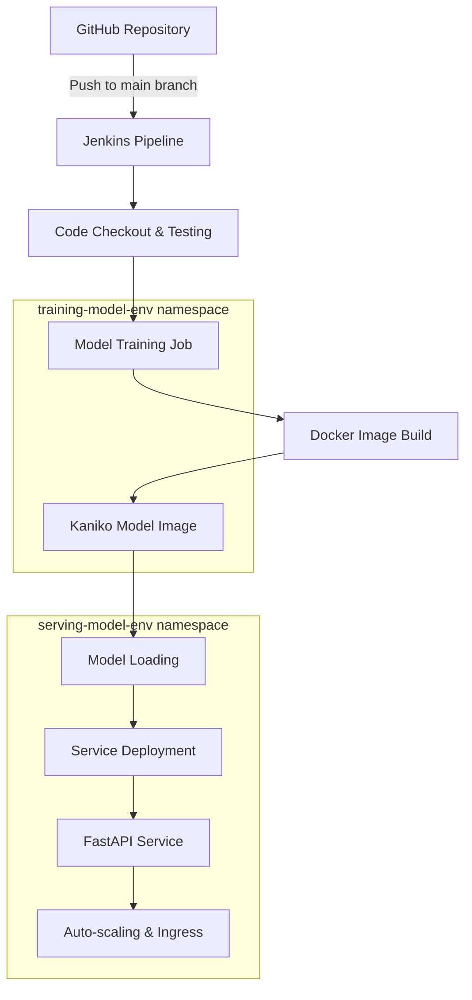
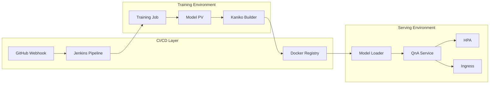

# 🤖 Extractive Question Answering - MLOps Pipeline

[](https://opensource.org/licenses/MIT)
[](https://www.python.org/downloads/)
[](https://www.docker.com/)
[](https://minikube.sigs.k8s.io/)
[](https://www.jenkins.io/)

A production-ready MLOps pipeline for deploying an Extractive Question Answering model with automated training, testing, and deployment using Jenkins, Docker, and Kubernetes.

## 📋 Table of Contents

- [Overview](#-overview)
- [Architecture](#-architecture)
- [Features](#-features)
- [Prerequisites](#-prerequisites)
- [Quick Start](#-quick-start)
- [Pipeline Stages](#-pipeline-stages)
- [API Usage](#-api-usage)
- [Monitoring & Scaling](#-monitoring--scaling)
- [Configuration](#-configuration)
- [Troubleshooting](#-troubleshooting)
- [Contributing](#-contributing)

## 🎯 Overview

This project implements a complete MLOps workflow for an Extractive Question Answering model that:

- **Automatically trains** the model when code is pushed to the repository
- **Runs comprehensive tests** to ensure quality
- **Builds and pushes** Docker images with trained model weights
- **Deploys** the model as a scalable FastAPI service on Kubernetes
- **Exposes** an `/answer` endpoint for real-time inference
- **Auto-scales** based on CPU utilization (2-10 replicas)

## 🏗️ Architecture

### High-Level Architecture



### Component Architecture



## ✨ Features

### 🔄 **Automated CI/CD Pipeline**
- **GitHub Integration**: Webhook triggers on push to `main` branch
- **Automated Testing**: pytest execution before deployment
- **Email Notifications**: Success/failure alerts
- **Clean Workspace**: Automatic cleanup after pipeline execution

### 🎯 **Model Training & Management**
- **Containerized Training**: Isolated training environment using `ashutoshj/training_image2`
- **Persistent Storage**: Model weights stored in Kubernetes Persistent Volumes
- **Version Control**: Automated model versioning with each training cycle
- **Training Validation**: Job completion monitoring with timeout (30 minutes)

### 🐳 **Docker & Containerization**
- **Multi-Stage Builds**: Optimized Docker images for training and serving
- **Kaniko Integration**: In-cluster image building without Docker daemon
- **Registry Management**: Automated push to Docker Hub
- **Image Layering**: Efficient layer caching for faster builds

### ☸️ **Kubernetes Deployment**
- **Namespace Isolation**: Separate environments for training and serving
- **Resource Management**: CPU/Memory limits and requests
- **Health Checks**: Readiness and liveness probes
- **Service Discovery**: Internal service communication

### 📈 **Auto-scaling & Load Balancing**
- **Horizontal Pod Autoscaler**: 2-10 replicas based on CPU (5% threshold)
- **NodePort Service**: External access via port 30008
- **Ingress Controller**: Custom domain routing (`qna-model.local`)
- **Load Distribution**: Traffic balancing across multiple pods

### 🔒 **Security & Best Practices**
- **Secret Management**: Kubernetes secrets for Docker registry credentials
- **RBAC**: Role-based access control for service accounts
- **Non-root Containers**: Security-first container design
- **Network Policies**: Namespace-level network isolation

## 🛠️ Prerequisites

### Software Requirements
- **Docker** (main0.0+)
- **Kubernetes/Minikube** (v1.20+)
- **Jenkins** (main.300+)
- **Python** (3.10)
- **kubectl** CLI tool

### Jenkins Plugins Required
```bash
- Docker Pipeline
- Kubernetes CLI
- GitHub Integration
- Pipeline: Stage View
- Email Extension
```

### Docker Hub Setup
```bash
# Required Docker images
ashutoshj/qna_service          # FastAPI service
ashutoshj/training_image2      # Model training
ashutoshj/trained-model-image2 # Model with weights
```

## 🚀 Quick Start

### 1. Clone Repository
```bash
git clone https://github.com/Ashutosh-Jadhav/ML_Ops.git
cd ML_Ops
git checkout main
```

### 2. Setup Minikube
```bash
# Start Minikube
minikube start --driver=docker --memory=4096 --cpus=2

# Enable Ingress
minikube addons enable ingress

# Create namespaces
kubectl create namespace training-model-env
kubectl create namespace serving-model-env
```

### 3. Configure Jenkins
```bash
# Install Jenkins (if not installed)
# Add required plugins and configure credentials:

# 1. MINIKUBE_KUBECONFIG - Kubernetes config file
# 2. DockerHubCred - Docker Hub credentials  
# 3. K8S_SECRET_FILE - Kubernetes secret for Docker registry
```

### 4. Setup Docker Registry Secret
```bash
# Create Docker registry secret
kubectl create secret docker-registry regcred \
  --docker-server=docker.io \
  --docker-username=<your-username> \
  --docker-password=<your-password> \
  --docker-email=<your-email> \
  -n training-model-env
```

### 5. Configure GitHub Webhook
```bash
# In your GitHub repository settings:
# Webhooks → Add webhook
# URL: http://your-jenkins-url/github-webhook/
# Content type: application/json
# Events: Push events
```

### 6. Trigger Pipeline
```bash
# Push code to main branch to trigger the pipeline
git add .
git commit -m "Trigger MLOps pipeline"
git push origin main
```

## 📊 Pipeline Stages

### Stage 1: Code Checkout
```bash
✅ Clone repository (main branch)
✅ Validate code structure
✅ Set environment variables
```

### Stage 2: Testing
```bash
✅ Run pytest on QnA service
✅ Validate model loading functions
✅ Check API endpoint compatibility
```

### Stage 3: Model Training
```bash
✅ Deploy training job in training-model-env
✅ Monitor job completion (30min timeout)
✅ Validate trained model artifacts
✅ Store weights in Persistent Volume
```

### Stage 4: Service Build
```bash
✅ Build QnA service Docker image
✅ Tag with latest version
✅ Validate image layers
```

### Stage 5: Image Push
```bash
✅ Push service image to Docker Hub
✅ Verify image availability
✅ Update image tags
```

### Stage 6: Model Image Build
```bash
✅ Use Kaniko for in-cluster builds
✅ Combine trained weights with base image
✅ Push model image to registry
✅ Clean up build resources
```

### Stage 7: Model Loading
```bash
✅ Extract model from container image
✅ Copy to serving Persistent Volume
✅ Validate model integrity
✅ Prepare for inference
```

### Stage 8: Service Deployment
```bash
✅ Deploy QnA service pods
✅ Configure service exposure
✅ Setup ingress routing
✅ Enable auto-scaling
✅ Verify deployment health
```

## 🔗 API Usage

### Base URL
```bash
# NodePort Access
http://minikube-ip:30008

# Ingress Access (add to /etc/hosts)
http://qna-model.local
```

### Question Answering Endpoint

**POST** `/answer`

```bash
curl -X POST "http://qna-model.local/answer" \
  -H "Content-Type: application/json" \
  -d '{
    "question": "What is the capital of France?",
    "context": "France is a country in Europe. Its capital city is Paris, which is known for the Eiffel Tower and Louvre Museum."
  }'
```

**Response:**
```json
{
  "answer": "Paris",
  "confidence": 0.95,
  "start_pos": 45,
  "end_pos": 50
}
```

### Health Check Endpoint

**GET** `/health`

```bash
curl http://qna-model.local/health
```

**Response:**
```json
{
  "status": "healthy",
  "model_loaded": true,
  "version": "1.0.0",
  "timestamp": "2025-06-16T10:30:00Z"
}
```

## 📈 Monitoring & Scaling

### Auto-scaling Configuration
```yaml
# HPA Settings
minReplicas: 2
maxReplicas: 10
targetCPUUtilizationPercentage: 5
```

### Monitor Scaling
```bash
# Watch HPA status
kubectl get hpa qna-hpa -n serving-model-env -w

# Check pod scaling
kubectl get pods -n serving-model-env -w

# View resource usage
kubectl top pods -n serving-model-env
```

### Logs & Debugging
```bash
# Service logs
kubectl logs -f deployment/model-inference -n serving-model-env

# Training job logs
kubectl logs job/train-model-job -n training-model-env

# Pipeline logs
# Available in Jenkins console output
```

## ⚙️ Configuration

### Environment Variables
```bash
# Jenkinsfile environment
DOCKER_IMAGE_NAME=ashutoshj/qna_service
GITHUB_REPO_URL=https://github.com/Ashutosh-Jadhav/ML_Ops.git
```

### Persistent Volume Configuration
```yaml
# Model storage
capacity: 1Gi
accessModes: ReadWriteOnce
hostPath: /mnt/model
reclaimPolicy: Retain
```

### Service Configuration
```yaml
# Service exposure
type: NodePort
port: 5000
nodePort: 30008
```

### Ingress Configuration
```yaml
# Domain routing
host: qna-model.local
path: /
pathType: Prefix
```

## 🐛 Troubleshooting

### Common Issues

#### 1. Pipeline Fails at Training Stage
```bash
# Check training job status
kubectl get jobs -n training-model-env
kubectl describe job train-model-job -n training-model-env
kubectl logs job/train-model-job -n training-model-env
```

#### 2. Kaniko Build Failures
```bash
# Check Kaniko job logs
kubectl logs job/kaniko-build-job -n training-model-env

# Verify Docker registry credentials
kubectl get secret regcred -n training-model-env -o yaml
```

#### 3. Service Not Accessible
```bash
# Check service status
kubectl get svc model-service -n serving-model-env
kubectl get ingress qna-ingress -n serving-model-env

# Verify pod status
kubectl get pods -n serving-model-env
kubectl describe pod <pod-name> -n serving-model-env
```

#### 4. Model Loading Issues
```bash
# Check model extraction job
kubectl logs job/copy-model-job -n serving-model-env

# Verify PV/PVC status
kubectl get pv,pvc -n serving-model-env
```

### Performance Tuning

#### Resource Optimization
```yaml
# Recommended resource limits
resources:
  requests:
    memory: "512Mi"
    cpu: "250m"
  limits:
    memory: "1Gi" 
    cpu: "500m"
```

#### Auto-scaling Tuning
```yaml
# For high-traffic environments
minReplicas: 3
maxReplicas: 20
targetCPUUtilizationPercentage: 10
```

## 🤝 Contributing

### Development Workflow
1. Fork the repository
2. Create a feature branch (`git checkout -b feature/amazing-feature`)
3. Make your changes
4. Add tests for new functionality
5. Commit changes (`git commit -m 'Add amazing feature'`)
6. Push to branch (`git push origin feature/amazing-feature`)
7. Open a Pull Request

### Code Standards
- Follow PEP 8 for Python code
- Use meaningful commit messages
- Add docstrings for all functions
- Include unit tests for new features
- Update documentation as needed

### Testing
```bash
# Run local tests
pytest qna_service/qna_testing.py -v

# Test Docker build
docker build -t qna_service_test ./qna_service

# Test Kubernetes manifests
kubectl apply --dry-run=client -f model-inference-manifests/
```

## 📄 License

This project is licensed under the MIT License - see the [LICENSE](LICENSE) file for details.

## 🙏 Acknowledgments

- **Transformers Library** for the base QnA model
- **FastAPI** for the efficient web framework
- **Jenkins** for CI/CD automation
- **Kubernetes** for container orchestration
- **Docker** for containerization
- **Kaniko** for in-cluster builds

## 📞 Support

For support and questions:

- **Email**: ashutosh.j001@gmail.com
- **Issues**: [GitHub Issues](https://github.com/Ashutosh-Jadhav/ML_Ops/issues)
- **Discussions**: [GitHub Discussions](https://github.com/Ashutosh-Jadhav/ML_Ops/discussions)

---

**Made with ❤️ by [Ashutosh Jadhav](https://github.com/Ashutosh-Jadhav)**

---

## 📚 Additional Resources

- [Kubernetes Documentation](https://kubernetes.io/docs/)
- [Jenkins Pipeline Syntax](https://www.jenkins.io/doc/book/pipeline/syntax/)
- [Docker Best Practices](https://docs.docker.com/develop/dev-best-practices/)
- [FastAPI Documentation](https://fastapi.tiangolo.com/)
- [MLOps Best Practices](https://ml-ops.org/)

*Last updated: June 16, 2025*
